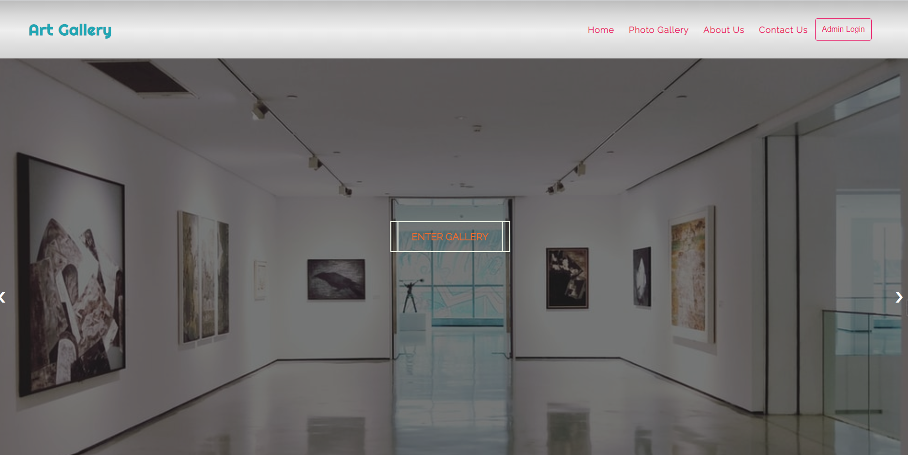

# Gallery-project-Group7

Group memembers : Kelly, Remon, Maksim, Samira, Brenda(Shijing)

make sure your tages name use semantic tags!

Sign in/up and password reset page, use css/authentication.css to style css.

index.html is home page.

general.css put global css files. And each specific css related to same name of html file.

Copy your local images to image folder. Make sure named specifically, please don't name like 1.png or 2.jpg etc.

js folder for future use. adding javascript files.

Include your css file to your html files in the <head> before push to github.

